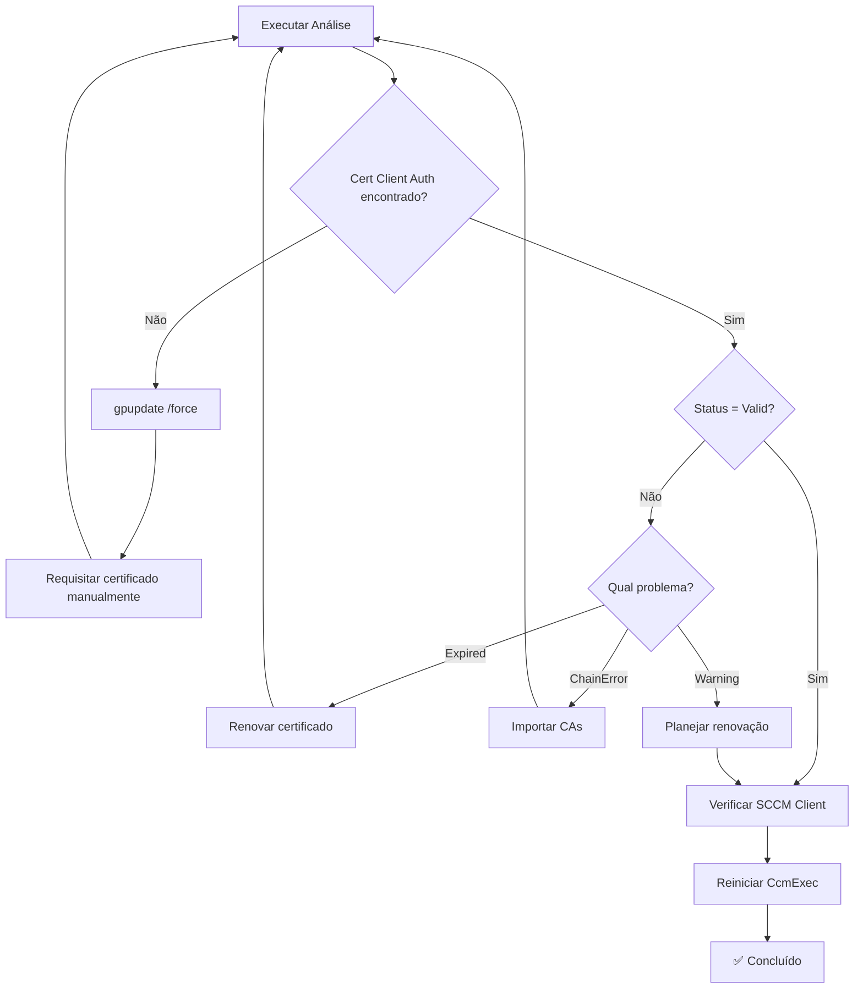
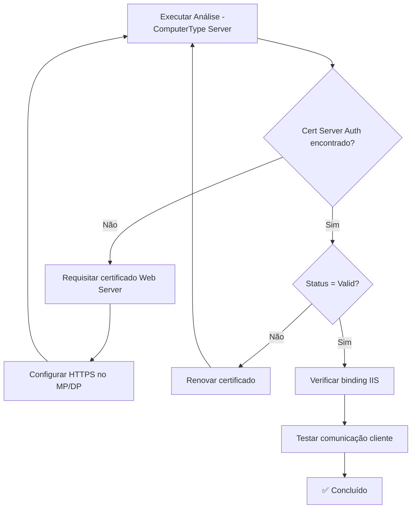

# Guia Rápido - Analyze-SCCM-Certificates.ps1

## 🚀 Início Rápido

### Execução Básica
```powershell
# Abrir PowerShell como Administrador
.\Analyze-SCCM-Certificates.ps1
```

---

## 📋 Cenários Comuns

### 1️⃣ Análise de Estação de Trabalho (Cliente SCCM)
```powershell
# Análise rápida de estação
.\Analyze-SCCM-Certificates.ps1 -ComputerType Workstation -ExportReport

# Saída esperada:
# - Lista de certificados Client Authentication com Thumbprint
# - Validação de certificados do computador
# - Status do cliente SCCM
# - Recomendações específicas para estação
```

**Quando usar:**
- Troubleshooting de problemas de autenticação SCCM em clientes
- Verificação de certificados antes de enrollment Azure AD
- Validação de deployment de certificados via GPO

---

### 2️⃣ Análise de Servidor SCCM (Site Server/MP/DP)
```powershell
# Análise completa de servidor SCCM
.\Analyze-SCCM-Certificates.ps1 -ComputerType Server -ExportReport

# Saída esperada:
# - Certificados Server Authentication com Thumbprint
# - Detecção de componentes SCCM (Site Server, MP, DP)
# - Validação de certificados HTTPS para Management Point
# - Recomendações específicas para servidor
```

**Quando usar:**
- Configuração de HTTPS em Management Point
- Troubleshooting de comunicação cliente-servidor
- Auditoria de certificados em infraestrutura SCCM

---

### 3️⃣ Análise Detalhada com Verificação de Revogação
```powershell
# Análise completa incluindo verificação de CRL
.\Analyze-SCCM-Certificates.ps1 -IncludeDetailedChain -ExportReport

# ⚠️ ATENÇÃO: Pode ser lento se CRL não estiver acessível
```

**Quando usar:**
- Auditoria de segurança completa
- Troubleshooting de problemas de validação de cadeia
- Verificação de certificados revogados

---

### 4️⃣ Análise com Caminho Customizado
```powershell
# Salvar relatórios em pasta específica
.\Analyze-SCCM-Certificates.ps1 -OutputPath "D:\Auditoria\Certificados" -ExportReport
```

---

## 🔍 Interpretando os Resultados

### Console - Resumo Final

```
========================================================
  ANALISE CONCLUIDA
========================================================

Arquivos gerados:
  - HTML Report: C:\...\SCCM-Certificates-Report-20260109-123456.html
  - JSON Data: C:\...\SCCM-Certificates-Data-20260109-123456.json
  - Log File: C:\...\SCCM-Certificates-Analysis-20260109-123456.log

Configuração:
  Tipo de Computador: Workstation
  Análise Detalhada: Não (rápida)

Resumo:
  Certificados SCCM Client Auth: 1        [✅ VERDE = OK]
  Problemas detectados: 0                 [✅ VERDE = OK]
  Certificados expirados: 0               [✅ VERDE = OK]
```

### Relatório HTML - Informações Incluídas

#### 📊 Tabela de Certificados SCCM Client Authentication
| Subject | **Thumbprint** | Expiração | Dias | Status |
|---------|---------------|-----------|------|--------|
| CN=COMPUTER01 | `ABC123...` | 2026-12-31 | 357 | ✅ Valid |

#### 📊 Tabela de Certificados do Computador
| Subject | **Thumbprint** | Issuer | EKU | Private Key | Expiração | Status |
|---------|---------------|--------|-----|-------------|-----------|--------|
| CN=COMPUTER01 | `ABC123...` | CN=Corp-CA | Client Auth | Sim | 2026-12-31 | ✅ Valid |

---

## ⚠️ Problemas Comuns e Soluções

### ❌ Problema: Nenhum Certificado SCCM Client Auth Encontrado

**Sintomas:**
```
[ERROR] Certificados SCCM Client Auth: 0
[CRITICO] Nenhum certificado Client Authentication encontrado
```

**Soluções:**
```powershell
# 1. Atualizar Group Policy
gpupdate /force

# 2. Verificar certificados manualmente
certlm.msc

# 3. Requisitar certificado manualmente
# MMC > Certificates > Computer > Personal > Request New Certificate

# 4. Executar análise novamente
.\Analyze-SCCM-Certificates.ps1 -ExportReport
```

---

### ⚠️ Problema: Certificado Expirando em Breve

**Sintomas:**
```
[WARN] Certificado expira em 15 dias
Status: Warning
```

**Soluções:**
```powershell
# 1. Renovar certificado via Group Policy
gpupdate /force
certutil -pulse

# 2. Ou renovar manualmente via MMC
certlm.msc
# Clicar com botão direito no certificado > All Tasks > Renew Certificate
```

---

### ❌ Problema: Cadeia de Certificados Inválida

**Sintomas:**
```
[ERROR] CHAIN INVALID: The revocation function was unable to check...
Status: ChainError
```

**Soluções:**
```powershell
# 1. Verificar conectividade com CRL
certutil -verify -urlfetch C:\Path\To\Certificate.cer

# 2. Importar CAs intermediários
# Obter CAs da cadeia
certutil -ca.cert ca_chain.p7b

# 3. Importar no store correto
Import-Certificate -FilePath ca_chain.cer -CertStoreLocation Cert:\LocalMachine\CA

# 4. Executar análise sem verificação de revogação (teste)
.\Analyze-SCCM-Certificates.ps1 -ExportReport
```

---

### 🖥️ Problema: Servidor SCCM sem Certificado Server Authentication

**Sintomas (em Servidor):**
```
[WARN] Nenhum certificado Server Authentication encontrado
[ERROR] Management Point requires Server Authentication certificate for HTTPS
```

**Soluções:**
```powershell
# 1. Verificar se template de servidor existe
# Abrir Certification Authority (certsrv.msc)
# Verificar templates disponíveis

# 2. Requisitar certificado de servidor
# MMC > Certificates > Computer > Personal > Request New Certificate
# Selecionar template "Web Server" ou "Computer"

# 3. Configurar HTTPS no Management Point
# Configuration Manager Console > Administration > Site Configuration >
# Servers and Site System Roles > Properties > Management Point

# 4. Verificar após aplicar certificado
.\Analyze-SCCM-Certificates.ps1 -ComputerType Server -ExportReport
```

---

## 📖 Informações nos Relatórios

### 1. Thumbprint do Certificado
**O que é:** Identificador único SHA-1 do certificado (40 caracteres hexadecimais)

**Onde encontrar:**
- Console: Nas saídas `[CLIENT AUTH]` e `[COMPUTER]`
- HTML: Coluna "Thumbprint" em todas as tabelas (formatado como código)
- JSON: Propriedade `Thumbprint` em cada objeto de certificado

**Para que usar:**
```powershell
# Exportar certificado específico usando Thumbprint
$thumbprint = "ABC123DEF456..."
$cert = Get-Item Cert:\LocalMachine\My\$thumbprint
Export-Certificate -Cert $cert -FilePath "certificado.cer"

# Vincular certificado a IIS/SCCM usando Thumbprint
# Configuration Manager Console > Site System Roles > Properties
# Especificar Thumbprint do certificado
```

---

### 2. Status de Certificado

| Status | Significado | Ação Requerida |
|--------|-------------|----------------|
| ✅ **Valid** | Certificado válido, cadeia OK, não expira em 30 dias | Nenhuma |
| ⚠️ **Warning** | Certificado expira em menos de 30 dias | Renovar em breve |
| ❌ **Expired** | Certificado expirado | Renovar imediatamente |
| ❌ **Invalid** | Certificado não é válido ainda | Verificar data do sistema |
| ❌ **ChainError** | Problema na cadeia de certificação | Importar CAs intermediários |

---

### 3. Enhanced Key Usage (EKU)

| EKU | OID | Uso |
|-----|-----|-----|
| **Client Authentication** | 1.3.6.1.5.5.7.3.2 | SCCM Client para servidor |
| **Server Authentication** | 1.3.6.1.5.5.7.3.1 | SCCM Server (MP/DP) HTTPS |
| **Code Signing** | 1.3.6.1.5.5.7.3.3 | Assinatura de código |

---

## 🔄 Fluxo de Troubleshooting

### Para Estações de Trabalho (SCCM Client)



### Para Servidores SCCM (MP/DP)



---

## 📞 Quando Precisa de Ajuda

Contactar suporte se:

1. ❌ Certificados não aparecem após `gpupdate /force`
2. ❌ Cadeia de certificados inválida persiste após importar CAs
3. ❌ Clientes não se comunicam com servidor mesmo com certificados válidos
4. ❌ Erro "Access Denied" mesmo executando como Admin

**Informações para fornecer:**
- Relatório HTML completo
- Arquivo JSON de dados
- Arquivo de log detalhado
- Screenshot de erros no console
- **Thumbprints dos certificados problemáticos**

---

## 💡 Dicas Profissionais

### ✅ Boas Práticas

1. **Execute análise regularmente:** Agendar verificação mensal
2. **Monitore expirações:** Alerta de certificados com <90 dias
3. **Documente Thumbprints:** Manter registro de certificados importantes
4. **Teste em servidor de teste:** Antes de aplicar em produção

### 📅 Agendamento Automático

```powershell
# Criar tarefa agendada para execução mensal
$action = New-ScheduledTaskAction -Execute 'PowerShell.exe' `
    -Argument '-ExecutionPolicy Bypass -File "C:\Scripts\Analyze-SCCM-Certificates.ps1" -ExportReport'

$trigger = New-ScheduledTaskTrigger -Monthly -At 2am -DaysOfMonth 1

$principal = New-ScheduledTaskPrincipal -UserID "NT AUTHORITY\SYSTEM" `
    -LogonType ServiceAccount -RunLevel Highest

Register-ScheduledTask -TaskName "SCCM Certificate Analysis" `
    -Action $action -Trigger $trigger -Principal $principal
```

---

## 📚 Recursos Adicionais

- Documentação completa: `README-Analyze-SCCM-Certificates.md`
- Microsoft Docs: [PKI Certificate Requirements for Configuration Manager](https://learn.microsoft.com/en-us/mem/configmgr/core/plan-design/network/pki-certificate-requirements)
- TechNet: Certificate Deployment Guide

---

**Okta7 Technologies | Daniel Marreiro | Sinqia Project**
